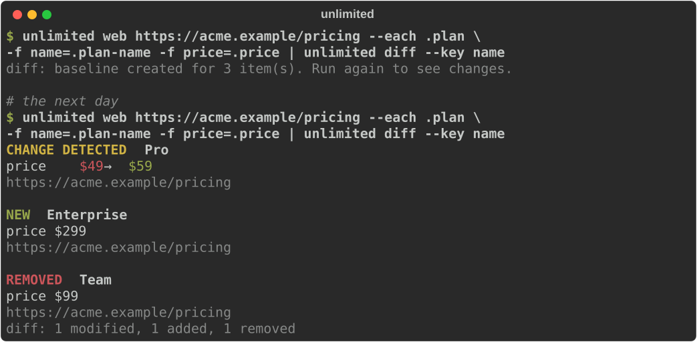

# UnlimitedPipe

**Pipe the public internet.**

Collect public web data, transform it, detect what changed, and send it anywhere, from the
command line. Local-first, no account, no API key, no AI required.



```bash
pip install unlimitedpipe

unlimited web https://example.com
unlimited web https://example.com | unlimited select title url | unlimited json
unlimited rss https://hnrss.org/frontpage | unlimited grep AI | unlimited diff --only added
```

## What is UnlimitedPipe?

A small set of Unix-style commands that pass **events** to each other:

```text
SOURCE  ->  EVENTS  ->  OPERATORS  ->  OUTPUT
web         JSONL       filter         json, jsonl, csv
rss                     select         feed (RSS / Atom / JSON Feed)
file                    diff           your terminal
...                     ...            any tool that reads JSONL
```

Every event is one line of JSON that records what was observed, where, when, how it was
fetched, and every step that touched it. Pipes work with `jq`, `grep`, `head` and friends.
The same components run from a YAML file with `unlimited run`.

## Why?

Everyone who works with the web has written the same throwaway script: fetch a page, pull out
a few values, compare with last time, send a notification. UnlimitedPipe is that script, done
once and done well:

- **Change detection built in.** `diff` remembers what it saw and emits only what was added,
  removed or modified, field by field.
- **Reads the most reliable layer first.** Product data from Shopify, schema.org JSON-LD or
  OpenGraph before any CSS selector. Feeds before HTML.
- **Provenance on every event.** Source URL, observation time, fetch method, and each operator
  that transformed it.
- **Polite by default.** robots.txt (RFC 9309), one request per second per host,
  `ETag`/`If-Modified-Since` revalidation, an honest User-Agent.
- **Composable.** JSONL in, JSONL out. Plain JSON from other tools is accepted too.
- **Extensible.** A connector is one small Python class; `pip install` makes it a command.

How it compares: `curl | jq` has no memory or change detection. changedetection.io and paid
monitors are apps, not composable pipes. Firecrawl and similar crawlers turn pages into text
for LLMs. UnlimitedPipe turns public sources into typed events with history and receipts,
and can use those tools as sources.

## Quick start

```bash
pip install unlimitedpipe          # Python 3.11+
```

Look at a page. In a terminal you get readable output; in a pipe you get JSONL.

```bash
unlimited web https://example.com
```

See what a site offers and the best way to read it:

```bash
unlimited inspect https://news.ycombinator.com
```

```text
Hacker News
https://news.ycombinator.com  ·  200  ·  text/html  ·  76 ms
✓ robots.txt    allowed
✗ JSON-LD       none
✗ Products      no product data
✗ OpenGraph     none
✓ Feeds         https://news.ycombinator.com/rss
✗ Sitemap       none found
✓ Readable HTML 666 words without JavaScript
Try:
  unlimited rss https://news.ycombinator.com/rss
  unlimited web https://news.ycombinator.com
  unlimited web https://news.ycombinator.com --selector 'h2'   # pick exact elements
```

Watch a product. The first run saves a baseline; later runs print only changes.

```bash
unlimited web https://www.allbirds.com/products/mens-strider-explore | unlimited diff
```

## Sources

| Command | Emits |
| --- | --- |
| `unlimited web URL...` | A `document` per page (title, description, headings, text, feeds). Pages with product data become one `product` per variant. `--selector CSS` emits `element`s, `--field NAME=CSS` builds `record`s, `--emit links` emits `link`s. |
| `unlimited rss URL...` | One `entry` per item of an RSS, Atom or JSON Feed. Given a page, uses the feed it advertises. |
| `unlimited file PATH...` | One `record` per JSON item, JSONL line or CSV row. `-` reads stdin. |
| `unlimited inspect URL...` | An `inspection`: robots.txt, feeds, JSON-LD, products, sitemap, JavaScript, suggested commands. |

Sources also read URLs from stdin, so crawls compose:

```bash
unlimited web https://blog.example.com --emit links | unlimited grep 2026 | unlimited web
```

GitHub releases work today through their Atom feeds, no token needed:

```bash
unlimited rss https://github.com/astral-sh/uv/releases.atom | unlimited limit 3
```

## Operators

| Command | Does |
| --- | --- |
| `select title price=offers.0.price` | Keep (and rename) fields |
| `filter 'price > 100 and availability == "InStock"'` | Keep matching events ([syntax](docs/expressions.md)) |
| `filter --field country --eq Thailand` | The same without expression syntax |
| `map 'price=number(price)' --drop junk` | Set fields from expressions, drop fields |
| `grep AI LLM` | Keep events mentioning any word (whole words, any case) |
| `dedupe --by url` | Drop repeats within the stream |
| `sort --by published_at -r` | Sort (reads the whole stream) |
| `limit 20` | First N events, then stop upstream |
| `diff` | Only what changed since the last run |

Fields are looked up in `data` first, then in the envelope (`source_url`, `metadata.status`).

## Outputs

| Command | Writes |
| --- | --- |
| `jsonl [PATH]` | Full events, one per line (`--data` for data only) |
| `json [PATH]` | One JSON array of data (`--full` for whole events) |
| `csv [PATH]` | Data as CSV, nested fields as dotted columns |
| `feed PATH` | RSS (`.xml`), Atom (`.atom`) or JSON Feed (`.json`), keeping earlier items |
| `pretty` | Readable terminal output (the default when stdout is a terminal) |

## Pipelines

The same components, in one process, from a file:

```yaml
# competitor-watch.yml
name: competitor-watch

sources:
  - type: web
    url: https://competitor.example/pricing
    each: .plan
    field: [name=.plan-name, price=.price]

operators:
  - type: diff
    key: name

outputs:
  - type: feed
    path: public/competitor.xml
  - type: pretty
```

```bash
unlimited run competitor-watch.yml
unlimited run competitor-watch.yml --validate
unlimited watch --every 1h competitor-watch.yml     # run it every hour until Ctrl+C
```

Short pipelines don't need a file. Separate stages with `--` and they run in one process:

```bash
unlimited run web https://example.com -- select title url -- json
unlimited watch --every 30m rss https://hnrss.org/frontpage -- grep AI -- diff --only added
```

`watch` keeps going when a run fails, reloads the pipeline file when you edit it, and adds a
little random delay so many watches don't hit a site at the same second.

Mistakes are reported with file, line and a suggestion:

```text
error: competitor-watch.yml:8: sources[0] (web): unknown option 'feild' for web
hint: did you mean 'field'?
```

To run it somewhere else on a schedule (cron, or a GitHub Actions workflow for a free hosted
feed), see [docs/pipelines.md](docs/pipelines.md).

## Change detection

`diff` stores a small state file per watch and compares each item with the previous run:

- Items are matched by their key: product URL + SKU, feed item id, or `--key FIELD`.
- Changes come out as `change` events with field-level `old` and `new` values.
- An item counts as removed only if its page or feed was fetched in this run, so a network
  failure never looks like everything disappeared.
- `--only added` turns any feed into a stream of new items. `--ignore FIELD` skips noisy
  fields. `--reset` starts a new baseline.

```json
{"type": "change", "key": "https://acme.example/pricing#Pro", "source_url": "https://acme.example/pricing",
 "data": {"change": "modified", "label": "Pro", "summary": "price: $49 → $59",
          "fields": [{"path": "price", "old": "$49", "new": "$59"}], "after": {"name": "Pro", "price": "$59"}}}
```

State lives in your platform's user state directory; set `UNLIMITEDPIPE_STATE_DIR` or
`diff --state FILE` to keep it elsewhere (for example, in a Git repository).

## AI integration

UnlimitedPipe is useful without AI, and v0.1 ships none. Optional AI operators
(`ai extract`, `ai summarize`, `ai classify`) are planned behind a provider interface with
local models (Ollama) first, and every AI result will keep the provenance of the event it came
from. Until then, pipe events into any LLM command-line tool:

```bash
unlimited web https://example.com/changelog | jq -r .data.text | llm "What changed?"
```

## Creating a connector

A source is a small Python class. Its typed fields become CLI options, YAML keys and Python
arguments at once:

```python
from unlimitedpipe import Event, Source, arg, opt


class HackerNews(Source):
    """Search Hacker News stories."""

    name = "hackernews"
    query: str = arg("Search words")
    limit: int = opt("Maximum stories", default=30)

    async def collect(self, ctx):
        response = await ctx.http.get(
            "https://hn.algolia.com/api/v1/search_by_date",
            params={"query": self.query, "tags": "story", "hitsPerPage": self.limit},
        )
        for hit in response.json()["hits"]:
            yield Event(source="hackernews", type="story", key=hit["objectID"],
                        data={"title": hit["title"], "url": hit["url"], "points": hit["points"]})
```

Register it with one entry point, `pip install` it, and `unlimited hackernews "local llm"`
works, with rate limiting, retries, robots.txt, `--help` and YAML support included.
[examples/plugin-hackernews](examples/plugin-hackernews) is a complete package to copy, and
[docs/connectors.md](docs/connectors.md) walks through creating, registering, testing,
documenting and submitting one.

## Architecture

- **Event** (`unlimitedpipe.event/1`): `id`, `source`, `type`, `key`, `source_url`,
  `timestamp`, `observed_at`, `data`, `metadata`, `provenance`. See [docs/events.md](docs/events.md).
- **Components** are dataclasses: sources implement `collect`, operators `process` or
  `apply`, outputs `open`/`write`/`close`. The CLI and YAML loader are generated from their
  fields.
- **Engine**: async generators chained source -> operators -> outputs. Streaming by default;
  only `sort` and whole-document outputs buffer. Stopping early (`limit`, Ctrl+C, a closed
  pipe) closes every stage, and outputs and diff state are always saved.
- **Network layer**: one shared client per run with per-host throttling, retries honoring
  `Retry-After`, RFC 9309 robots.txt with `Crawl-delay`, conditional requests, and a size cap.
- **Plugins**: the `unlimitedpipe.plugins` entry point group. Commands load lazily, so a pipe
  stage starts in about 150 ms.

```text
src/unlimitedpipe/
  event.py  component.py  engine.py  context.py  http.py  config.py  cli.py
  sources/    web, rss, file, inspect
  operators/  select, filter, map, grep, dedupe, limit, sort, diff
  outputs/    jsonl, json, csv, feed, pretty
```

## Examples

Runnable pipelines in [examples/](examples): website to JSON, an RSS news filter published as
a feed, GitHub release watching, price monitoring, competitor pricing watch, multi-source
research into CSV, and a complete connector package.

## Roadmap

- **v0.1 Pipe** (this release): engine, CLI, `web` with product detection, `rss`, `file`,
  `inspect`, eight operators, JSON/JSONL/CSV/feed outputs, YAML pipelines, plugins.
- **v0.2 Feed**: `watch`, `new` (generate a pipeline from a URL), `publish` (hosted feeds via
  GitHub Actions), `webhook`, `sqlite`, GitHub/API/SEC connectors, optional browser fetching
  and screenshot evidence.
- **v0.3 Live**: streaming sources, `window`/`count`/`trend`, an MCP server for AI agents,
  optional AI operators.

## Responsible use

UnlimitedPipe is for public data and data you are authorized to access. It uses the front
door: official APIs and feeds when they exist, polite HTML otherwise. It does not bypass
logins, CAPTCHAs or blocks, and it is not for collecting data about individuals. You are
responsible for complying with each site's terms and applicable law. See
[docs/responsible-use.md](docs/responsible-use.md).

## Contributing

Connectors, recipes and bug reports are all welcome. Start with
[CONTRIBUTING.md](CONTRIBUTING.md); `make test lint` runs the same checks as CI.

## License

[Apache-2.0](LICENSE)
